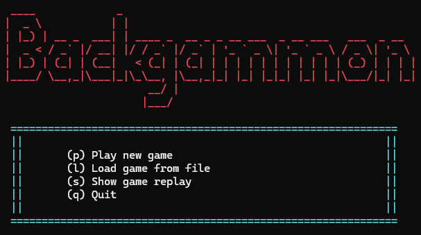
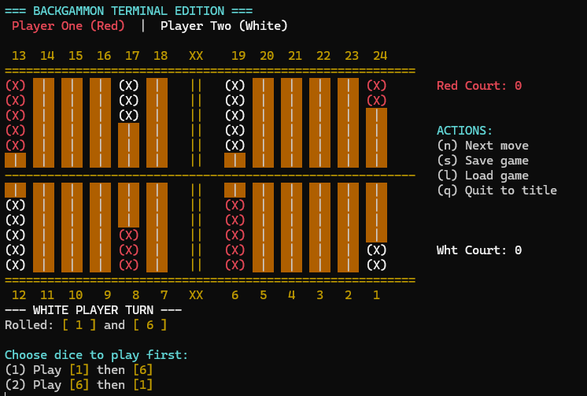

# Backgammon Terminal Edition

A fully functional, feature-rich terminal implementation of the classic Backgammon board game, written in C++. The game features a custom colored ANSI interface, a complete move replay system, and persistent score tracking.

## Screenshots

*(Replace the links below with actual paths to your images once uploaded to the repository)*

*Main Title Screen*

*In-game board with ANSI colors and custom UI*

---

## Key Features

* **Advanced Terminal UI:** Utilizes ANSI escape codes for a vibrant, colored board and interface directly in the command prompt.
* **Game State Management:** Save your current game to a file and load it later to resume playing.
* **Full Replay System:** Watch past games step-by-step. Navigate through the game history using next, previous, first, and last move controls.
* **Hall of Fame:** Persistent leaderboard that tracks and sorts the highest scores of different players across multiple sessions.
* **Input Handling:** Custom console input functions to ensure smooth gameplay without buffer issues or "double-enter" glitches.

## Prerequisites

To compile and run this game, you will need:
* A C++ compiler (e.g., GCC, MSVC).
* Windows OS (The game utilizes `<windows.h>` to enable virtual terminal processing for ANSI colors).

## Controls

The game is controlled entirely via the keyboard:
* `p` - Play a new game
* `l` - Load a saved game
* `s` - Show game replay (from the main menu) or Save game (during gameplay)
* `q` - Quit / Return to title
* **Numeric Input:** Used for selecting pawns and navigating the board. Confirmed with a single `Enter` press.

### Replay Controls
* `n` - Next move
* `p` - Previous move
* `f` - First move
* `l` - Last move
* `q` - Quit replay

## Project Structure

* `main.cpp` - Entry point and core game loop.
* `logic.cpp` / `logic.h` - Game rules, move validation, and dice rolling.
* `Board.cpp` / `board.h` - Board initialization and rendering logic.
* `ui.cpp` / `ui.h` - Interface rendering (menus, titles, headers).
* `file_io.cpp` / `file_io.h` - Handling saves, replays, and the Hall of Fame.

## Author

Marcin Tyszka